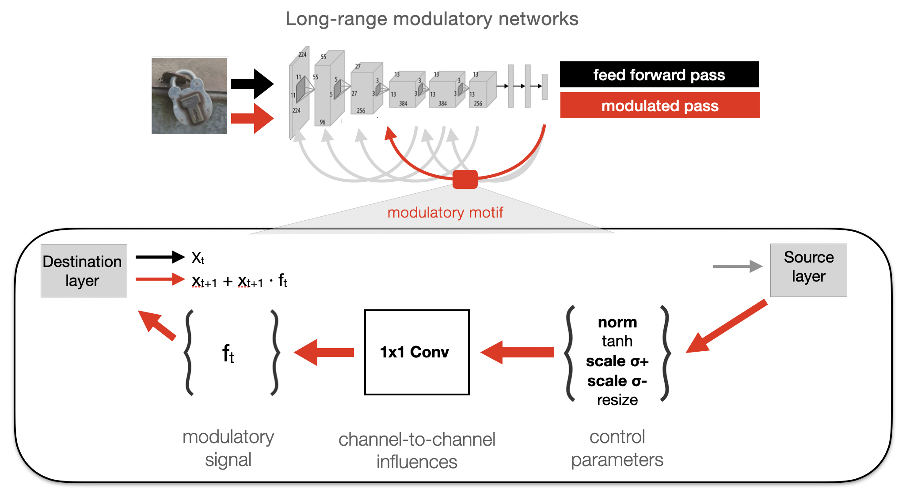
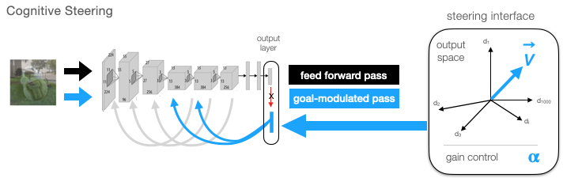
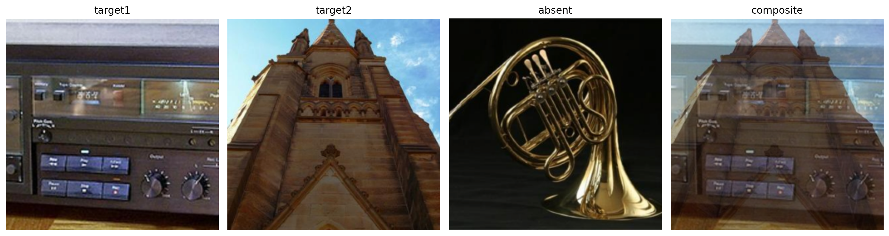

# Cognitive Steering in Deep Neural Networks via Long-Range Modulatory Feedback Connections

<!-- ### [Project Page](https://lrm-steering.github.io/) | [Paper](https://arxiv.org/abs/) | [Bibtex](#bibtex) -->

[Paper](https://openreview.net/forum?id=FCIj5KMn2m) | [Bibtex](#bibtex)

[](https://colab.research.google.com/drive/1rbb2xDQCmvWB-2UMNV7H8BNaQ5P9aScJ?usp=sharing)

[Talia Konkle](https://konklab.fas.harvard.edu/)\* $^{1,2,3}$, [George A. Alvarez](https://visionlab.harvard.edu/george/)\* $^{1,2,4}$
(*equal contribution)

$^1$ Harvard University, $^2$ Kempner Institute for the Study of Natural and Artificial Intelligence, $^3$ Center For Brain Science, $^4$ Vision-Sciences Laboratory
<br>



### **Summary**

Given the rich visual information available in each glance, humans can internally direct their visual attention to enhance goal-relevant information---a capacity often absent in standard vision models.  Here we introduce cognitively and biologically-inspired long-range modulatory pathways to enable ‘cognitive steering’ in vision models.  First, we show that models equipped with these feedback pathways naturally show improved image recognition, adversarial robustness, and increased brain alignment, relative to baseline models. Further,  these feedback projections from the final layer of the vision backbone provide a meaningful ***steering interface***, where goals can be specified as vectors in the output space.  We show that there are effective ways to steer the model which dramatically improve recognition of categories in composite images of multiple categories, succeeding where baseline feed-forward models without flexible steering fail. And, our multiplicative modulatory motif prevents rampant hallucination of the top-down goal category, dissociating what the model is looking for, from what it is looking at. Thus, these long-range modulatory pathways enable new behavioral capacities for goal-directed visual encoding, offering a flexible communication interface between cognitive and visual systems. 

## 🚀 Updates

**10/26/23**: Initial Code Release with pretrained LRM models (alexnet_lrm3, alexnet_lrm2, alexnet_lrm1), and the LRMNet + SteerableLRM wrappers

## Contents
* [Requirements](#requirements)
* [Quickstart](#quickstart)
    * [Load Pretrained LRM Models](#load-pretrained-lrm-models)
    * [Add Feedback Connections to Any ConvNet](#add-feedback-connections-to-any-convnet)
    * [LRMViT...Coming Soon](#lrmvit-coming-soon)
* [Cognitive Steering](#cognitive-steering)  
    * [What is Cognitive Steering?](#what-is-cognitive-steering)
    * [SteerableLRM Models](#steerablelrm-models)
* [NeurIPS 2023 Code](#neurips-2023-code)
* [LRM Training](#lrm-training)
* [Citation](#citation)

## Requirements
- Python 3
- Torch, Torchvision

## Usage

**For a walk through of the Quickstart and Steering examples see [Colab demo](https://colab.research.google.com/drive/1rbb2xDQCmvWB-2UMNV7H8BNaQ5P9aScJ?usp=sharing).**

## Quickstart

### Load Pretrained LRM Models
Load a pretrained model with "steering" mode (provides an easy cognitive steering interface):
```
import torch
model, transforms = torch.hub.load('harvard-visionlab/lrm-steering', 'alexnet_lrm3', pretrained=True, steering=True, force_reload=True)
print(model)
```

To load an lrm architecture for training, we recommend using the vanilla LRMNet class, which will omit the extra gizmos used to enable steering:
```
import torch
model, transforms = torch.hub.load('harvard-visionlab/lrm-steering', 'alexnet_lrm3', pretrained=False, steering=False, force_reload=True)
print(model)
```

### Add Feedback Connections to Any ConvNet
The LRMNet class enables you to add connections between any two layers of any convolutional neural network model (transformers coming soon). These connections can be long-range feedback, or if desired long-range skip forward connections (we have not trained models with these yet). Simply specify the "source" and "destination" for each connection using standard PyTorch layer names (e.g., dict(source="classifier.6", destination="features.8")). Although not a strict requirement, we tend to send feedback from "ReLU" layers backward to "pre-relu" Conv2d or Linear layers. If multiple sources target the same destination, their effects are added (we have not explored whether additional normalization might be needed with a large number of feedback sources to a single target):
```
import torch
import torchvision.models as tv_models

# Access the LRMNet class (or SteerableLRM if you want the steering interface enabled)
LRMNet = torch.hub.load('harvard-visionlab/lrm-steering', 'LRMNet', force_reload=True)

# instantiate alexnet baseline model
backbone = tv_models.alexnet(weights=None)

# specify modulatory connections
mod_connections = [
    # 1
    dict(source="classifier.6", destination="features.8"),             # output => conv4.conv
    dict(source="features.9", destination="features.0"),               # conv4.ReLU => conv1.conv

    # 2
    dict(source="classifier.6", destination="features.10"),            # output => conv5.conv
    dict(source="features.12", destination="features.3"),              # conv5.ReLU => conv2.conv

    # 3
    dict(source="classifier.2", destination="features.6"),             # fc6.ReLU => conv3.conv
]

# img_size should be the largest size expected during training
# (the model can opeate over any size, but uses interpolation to adjust 
# to different sizes)
model = LRMNet(backbone, mod_connections, forward_passes=2, img_size=224)    
```

### LRMViT Coming Soon
We have an analgous implementation for vision transformers which is coming soon...

## Cognitive Steering



### What is cognitive steering?
The basic idea with "Cognitive Steering" is that part of the cognitive system "beyond the visual system" provides a "steering signal" which will replace the default-feedback signals of the LRM model, essentially hijacking the feedback loop to steer feed-forward processing towards are particular goal or target. For example, say you want to determine if there is a dog present in the image. You might retrieve from memory the representation of a "prototypical dog" and use that "dog-prototype" as the feedback signal. Or, a language-vision interface might be used to convert the word "dog' to a predicted visual representation of "dog", and that representation will serve as the feedback signal. Either way, the cognitive system has provided you with a "vector" (or any shape "tensor"), which can then supplant the default feedback activations of the model, and potentially amplify target-consistent features and suppress target-inconsistent features.

Critically, because our feedback is multiplicative, rather than additive, the "feedback signal" doesn't simply "drive target activation". Continuing the example, in the absence of dog-relevant features, the feedback will have no effect - in other words multiplicative feedback prevents rampant hallucinations that are often observed with additive feedback.

To provide a "steering signal", all you need is a representation of the current "steering query" and to specify which feedback source this template is replacing (in our work, we only replace the final network output with steering templates, capturing the notion that it's the final stages of the visual system that interface with the cognitive system). 

### SteerableLRM Models
Models loaded with the "SteerableLRM" class have an easy interface for cognitive steering. 

```
import torch
model, transforms = torch.hub.load('harvard-visionlab/lrm-steering', 'alexnet_lrm3', pretrained=True, steering=True, force_reload=True)

# random vector for testing...
steering_query = torch.randn(1,1000) 

# replace classifier.6 feedback activation with the steering_query
# strength is gain control, a multiplier on the "default" feedback strength learned by the model
# we find optimal steering with strength=3
steering_signals = [
    dict(source='classifier.6', activation=steering_query, strength=3) 
]
img = torch.rand(1,3,224,224)
model.eval()
with torch.no_grad():
    outputs = model(img, steering_signals=steering_signals)

# print output shapes
for idx,output in enumerate(outputs):
    print(f"output pass{idx}: {output.shape}")
```

For an example with actual steering_templates (category prototypes), see our [Colab demo](https://colab.research.google.com/drive/1rbb2xDQCmvWB-2UMNV7H8BNaQ5P9aScJ?usp=sharing), specifically the section on the Composite Image Challenge.

### Composite Image Challenge
To assess the steerability of our LRM models, we introduced a "composite image challenge" in which images from two separate classes are combined (either side-by-side, or spatially overlapped and blended 50/50). Standard models are unable to classify these images correctly, and typically don't even have the correct classes within the top2. That is, to most models, composite images don't appear to be either class, particularly when the images are overlapping. LRM models can overcome this limitation by "querying" one of the target classes (e.g., steering with the template for classA or classB), and are able to correctly classify the target classes, in some cases approaching the level expected for either image presented alone.

<table style="width:90%; margin-left:auto; margin-right:auto; max-width:600px">
  <tr>
    <td style="text-align:center;">
      <br>
      <p style="text-align:left"><em>Composite Image Challenge.</em> Three images from different classes are selected. Two of the images are combined to form a composite image. Effective steering should be able to amplify either of the classes that are present (497, 574), but shouldn't hallucinate classes that are absent (e.g., 0).</p>
    </td>
  </tr>
</table>

Our [Colab demo](https://colab.research.google.com/drive/1rbb2xDQCmvWB-2UMNV7H8BNaQ5P9aScJ?usp=sharing) demonstrates how to assess LRM models on the composite image challenge.

## NeurIPS 2023 Code
The [neurips2023](./neurips2023/README.md) folder contains our original lrm implementation and model training scripts, in addition to analysis scripts and demos for the results reported in the paper.

## LRM Training
LRM models can be incorporated into your standard model-training pipeline, with one ammendment: we recommend computing the loss on the model outputs after each forward pass, in order to require the model to have a healthy, performant initial forward-pass.

```
model.to(device)
model.train()
for ix, (images, target) in enumerate(dataloader):
    optimizer.zero_grad(set_to_none=True)
    outputs = model(images.to(device))
    loss_train = torch.tensor(0.0, requires_grad=True) 
    for output in outputs:
        loss_train = loss_train + loss(output, target)
    loss_train = loss_train / len(outputs)
    loss.backward()
    optimizer.step()        
```

The training script for models reported in our neurips2023 paper can be found in the subfolder [train_supervised_steps.py](neurips2023/train_supervised_steps.py).

<a name="bibtex"></a>
## Citation

If you find our work or any of our materials useful, please cite our paper:
```
@inproceedings{konkle2023cognitive,
  title={Cognitive Steering in Deep Neural Networks via Long-Range Modulatory Feedback Connections},
  author={Konkle, Talia and Alvarez, George A},
  booktitle={Thirty-seventh Conference on Neural Information Processing Systems},
  year={2023}
  url={https://openreview.net/forum?id=FCIj5KMn2m}
}
```

## Acknowledgements
Our README.md was modeled after Shobhita Sundaram's very nice [deepsim](https://github.com/ssundaram21/dreamsim) repo. Our [model training script](neurips2023/train_supervised_steps.py) was based off of the [ffcv imagenet example](https://github.com/libffcv/ffcv-imagenet/tree/f134cbfff7f590954edc5c24275444b7dd2f57f6). Our text-to-vision interface was modeled after the "diffusion prior" of the [Dalle2 architecture](https://arxiv.org/abs/2204.06125) using the lucidrains PyTorch implementation (https://github.com/lucidrains/DALLE2-pytorch), modified to allow mapping from N-D to M-D feature spaces, since our vision models had a different output dimension than the CLIP text encoders.
